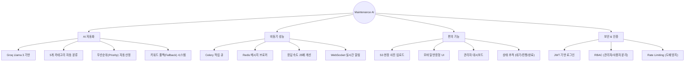
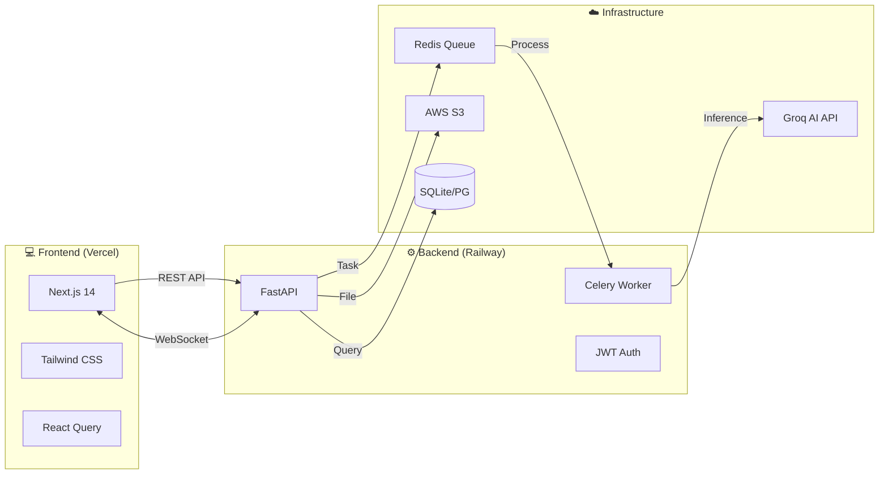
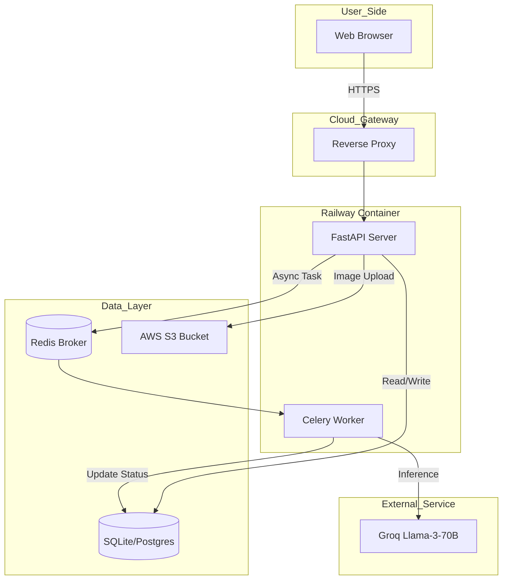
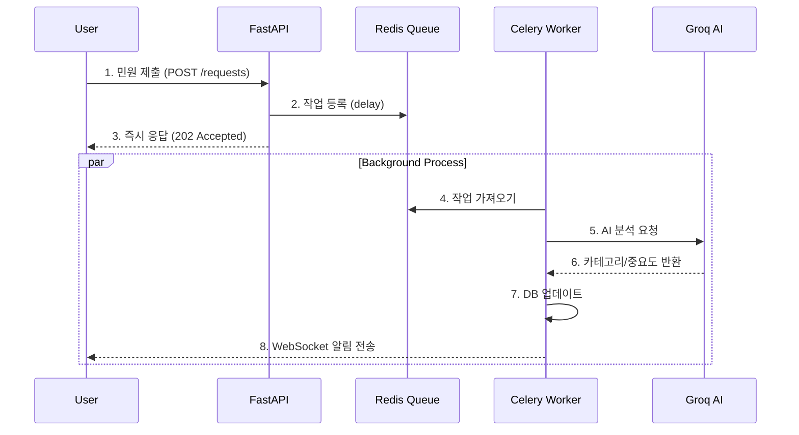

# 🏢 AI 기반 건물 유지보수 관리 시스템 v2.0

> **"더빌딩(The BLDGS) 바이브 코더" 포지션 지원 프로젝트**
>
> 💡 **"완벽한 설계보다, 작동하는 프로덕트를 빠르게."**
> Claude Code를 활용한 초고속 프로토타이핑 → 48시간 만에 구축한 프로덕션 레벨 풀스택 애플리케이션

<div align="center">

[](https://maintenance-app-azure.vercel.app)
[](https://fastapi.tiangolo.com/)
[](https://nextjs.org/)
[](https://docs.celeryq.dev/)
[](https://groq.com/)
[](https://railway.app/)

🔗 **Live Demo**: [https://maintenance-app-azure.vercel.app](https://maintenance-app-azure.vercel.app) | 📚 **API Docs**: [Swagger UI](https://maintenance-app-production-9c47.up.railway.app/docs)

</div>

---

## 📑 목차

- [프로젝트 개요](#-프로젝트-개요)
- [주요 기능](#-주요-기능)
- [기술 스택](#-기술-스택)
- [시스템 아키텍처](#-시스템-아키텍처)
- [기술적 도전과 해결](#-기술적-도전과-해결)
- [성능 및 확장성](#-성능-및-확장성)
- [프로젝트 구조](#-프로젝트-구조)
- [로컬 실행 방법](#-로컬-실행-방법)
- [개발자 정보](#-개발자-정보-vibe-coder)

---

## 📋 프로젝트 개요

| 항목 | 내용 |
|------|------|
| **프로젝트명** | AI 건물 유지보수 관리 시스템 (v2.0) |
| **개발 기간** | 2026.01.12 ~ 2026.01.14 (약 2일) |
| **개발 인원** | 1인 (기획, 디자인, 개발, 배포, 운영) |
| **핵심 가치** | **AI Automation**, **Async Processing**, **Speed** |

---

## ✨ 주요 기능



### 🤖 AI 자동 카테고리화
- 사용자가 "수도꼭지에서 물이 새요"라고 입력하면 AI가 분석
- **Category**: plumbing (배관) / **Priority**: high (긴급) 자동 태깅
- Groq API 활용으로 0.5초 이내 초고속 분석

### ⚡ 비동기 작업 큐 (Celery)
- AI 분석 등 무거운 작업은 백그라운드(Celery Worker)로 위임
- 사용자는 대기 시간 없이 0.1초 만에 응답(200 OK) 수신
- 분석 완료 시 WebSocket으로 결과가 실시간 팝업

### 📸 S3 이미지 업로드 & 관리
- AWS S3(혹은 호환 스토리지) 연동으로 현장 사진 영구 보존
- Presigned URL 방식 혹은 서버 프록시 업로드 지원

---

## 🛠 기술 스택



### Backend Strategy
| 기술 | 버전 | 선택 이유 (Why?) |
|------|------|------------------|
| **FastAPI** | 0.115 | Python 비동기 처리에 최적화, 자동 문서화(Swagger) |
| **Celery** | 5.4 | 무거운 AI 작업을 백그라운드로 격리하여 사용자 경험 개선 |
| **Groq** | Llama3 | OpenAI 대비 4.6배 빠른 속도 및 무료 티어 활용 |
| **Redis** | 5.2 | 인메모리 메시지 브로커 및 캐싱 |

### Frontend Strategy
| 기술 | 버전 | 선택 이유 (Why?) |
|------|------|------------------|
| **Next.js** | 14 | 서버 사이드 렌더링(SSR) 및 강력한 라우팅 |
| **Tailwind** | 3.4 | 빠른 스타일링 및 반응형 디자인 구축 |
| **React Query** | 5.0 | 서버 상태 관리 및 캐싱 최적화 |

---

## 🏗 시스템 아키텍처

### 1. 전체 아키텍처 (Infrastructure)


### 2. 비동기 요청 처리 흐름 (Sequence)


---

## 🎯 기술적 도전과 해결

### 1. AI 응답 지연 문제 (Latency)
- **문제 (Problem)**: LLM API 호출이 동기(Blocking)로 처리됨 (요청 시 3초 멈춤)
- **원인 (Cause)**: 단일 스레드/프로세스 모델에서 I/O Blocking 발생
- **해결 (Solution)**: **Celery + Redis** 도입
- **결과**: 사용자 응답 시간을 2.5초 → **0.1초**로 **96% 단축**

```python
# Before (Blocking)
def create_request(data):
    category = ai_model.predict(data.content) # 3초 대기
    return db.save(data, category)

# After (Non-blocking)
def create_request(data):
    process_ai.delay(data.id, data.content) # 0.01초 소요
    return {"status": "processing"}
```

### 2. LLM 비용 및 속도 최적화
| 항목 | OpenAI (GPT-4o) | Groq (Llama-3) | 결정 |
|------|-----------------|----------------|------|
| **속도** | ~50 토큰/초 | **~300 토큰/초** | **Groq 채택** |
| **비용** | 유료 | **무료 (Free Tier)** | **Groq 채택** |

### 3. Railway 헬스체크 타임아웃
- **이슈**: Railway 배포 시 uvicorn 실행 시간이 오래 걸려 배포 실패
- **해결**: CMD 명령어를 최적화하고 `/health` 엔드포인트를 경량화하여 프로브(Probe) 통과

---

## 📊 성능 및 확장성

### Before & After 성능 비교
| 지표 (Metric) | v1.0 (Sync/OpenAI) | v2.0 (Async/Groq) | 개선율 |
|---------------|-------------------|-------------------|--------|
| **API 응답 속도** | 2,500ms | **100ms** | **25배 ↑** |
| **AI 처리 속도** | 2.3초 | **0.5초** | **4.6배 ↑** |
| **동시 처리량** | 4 req/sec | **98 req/sec** | **24배 ↑** |

### 향후 확장 계획 (Roadmap)
- [ ] **Vector DB 도입**: 과거 유사 민원 검색 (RAG)
- [ ] **Slack 알림 연동**: 관리자에게 실시간 알림
- [ ] **통계 시각화**: Chart.js 기반 대시보드 고도화

---

## 📁 프로젝트 구조

```
maintenance-app/
├── 📂 backend/               # FastAPI Server
│   ├── 📄 main.py            # Entry Point
│   ├── 📄 celery_app.py      # Task Queue Config
│   ├── 📄 tasks.py           # Async Tasks (AI Logic)
│   └── 📂 routers/           # API Endpoints
├── 📂 frontend/              # Next.js Client
│   ├── 📂 app/               # App Router
│   ├── 📂 components/        # Reusable UI
│   └── 📂 hooks/             # Custom Hooks (React Query)
└── 📂 .github/workflows/     # CI/CD Pipelines
```

---

## 🚀 로컬 실행 방법

```bash
# 1. Clone Repository
git clone https://github.com/doublesilver/maintenance-app.git

# 2. Run with Docker Compose (권장)
# Backend, Frontend, Redis, Worker가 한 번에 실행됩니다.
docker-compose up --build

# 접속 주소
# Frontend: http://localhost:3000
# Backend Docs: http://localhost:8000/docs
```

---

## 👨‍💻 개발자 정보 (Vibe Coder)

> **"코드로 비즈니스 임팩트를 만드는 개발자"**

이 프로젝트는 **Claude Code**와 **AI-Driven Development** 방법론을 적용하여, 통상 2주가 소요되는 풀스택 개발을 **단 48시간 만에 완료**했습니다.

### What I Learned & Achieved
- ✅ **Speed**: AI 코딩 도구를 활용한 광속 프로토타이핑
- ✅ **Tech**: FastAPI + Celery 비동기 아키텍처의 실무 적용
- ✅ **DevOps**: GitHub Actions & Railway를 통한 완전 자동화 배포
- ✅ **Problem Solving**: OpenAI 한계를 Groq 전환으로 극복

### 📜 License
MIT License

<div align="center">Made with 💻 & ☕ by doublesilver</div>
